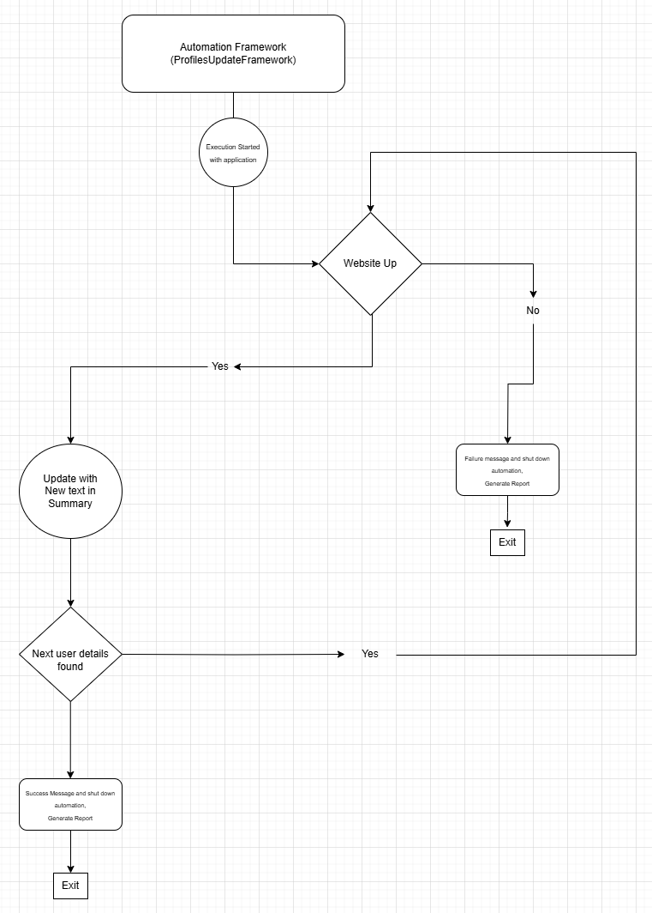

# ProfilesUpdateFramework
## This project is for updating profiles for getting Jobs 

### Porfiles used to update Naukri, NaukriGulf, Indeed, Bayt, etc

Architechture

Description:

Profile Updater will do multiple actions
1. Check for Website is live
2. If failure exit automation and generate report
3. If Live then will get username and password from .properties file
4. Next update the Summary section with a message which will be read from a properties file as well
5. Recheck for any more user available for updating. 
6. If updating successful then generate success report and exit the system

### Project updated and can be found in GIT location https://github.com/sayanbhandari001/ProfilesUpdateFramework.git
## This project can also be executed using Jenkins with Parameters
